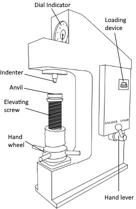
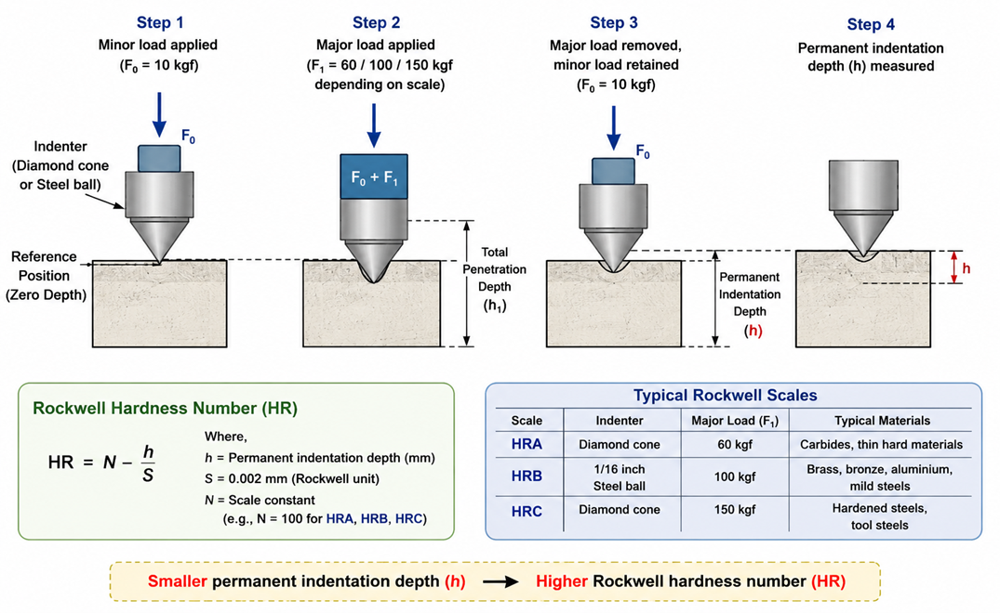

### Physical Concept

Hardness is the ability of a material to resist **permanent surface deformation**, such as indentation, scratching, or abrasion. Unlike tensile or compression tests, which determine the bulk mechanical properties of a material, hardness tests evaluate the resistance of a material's surface to localized plastic deformation.

The **Rockwell hardness test**, developed by Stanley P. Rockwell in 1919, is one of the most widely used hardness tests because it provides rapid and direct hardness measurements without requiring microscopic measurement of the indentation.

The Rockwell hardness number is determined from the **difference in indentation depth** produced by applying a major load after a minor preload has established a reference position.

**Figure 1. Rockwell hardness testing machine showing the indenter, specimen support, loading mechanism, and dial indicator.**

### Everyday Intuition

Hardness influences how well a material resists wear and permanent surface damage.

Common examples include:

- Cutting tools that must resist wear during machining.
- Gear teeth that repeatedly contact one another.
- Ball bearings subjected to continuous rolling contact.
- Railway tracks and wheels resisting surface deformation.
- Machine shafts and dies requiring hard outer surfaces.

Harder materials generally resist scratching, indentation, and abrasion better than softer materials.

### Experimental Relevance

In the Rockwell hardness test:

- A **minor load** is first applied to seat the indenter and establish a reference position.
- A **major load** is then applied, causing additional penetration.
- After removing the major load while retaining the minor load, the remaining indentation depth is measured automatically.
- The machine directly displays the Rockwell hardness number without requiring optical measurement.

Different Rockwell scales use different indenters and loads depending on the material being tested.

**Figure 2. Principle of the Rockwell hardness test showing application of minor load, major load, and measurement of permanent indentation depth.**

### Mathematical Formulation

The Rockwell hardness number is based on the permanent increase in indentation depth.

In general,

$$
HR = N-\frac{h}{S}
$$

where

- $HR$ = Rockwell hardness number
- $h$ = permanent indentation depth
- $S = 0.002\ \text{mm}$ (Rockwell unit)
- $N$ = scale constant depending on the Rockwell scale

Typical Rockwell scales include:

| Scale | Indenter             | Major Load | Typical Materials             |
| ----- | -------------------- | ---------- | ----------------------------- |
| HRA   | Diamond cone         | 60 kgf     | Carbides, thin hard materials |
| HRB   | 1/16 inch steel ball | 100 kgf    | Brass, bronze, aluminium      |
| HRC   | Diamond cone         | 150 kgf    | Hardened steels               |

A smaller indentation depth corresponds to a higher hardness number.

### Apparatus-Specific Application

The Rockwell hardness testing machine consists of:

- Diamond cone or steel-ball indenter
- Anvil to support the specimen
- Minor and major loading mechanisms
- Dial indicator or digital display
- Load selection mechanism

During the experiment, the specimen is placed on the anvil, the minor load is applied first, followed by the major load. The machine automatically indicates the hardness number corresponding to the selected Rockwell scale.

### Engineering Significance

Rockwell hardness testing is widely used because it is:

- Rapid
- Non-destructive for most engineering components
- Simple to perform
- Suitable for production quality control
- Highly repeatable

Hardness measurements are extensively used in:

- Heat-treatment verification
- Material selection
- Manufacturing quality control
- Automotive components
- Aerospace alloys
- Machine tools
- Bearings and gears
- Structural steel inspection
